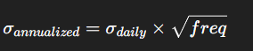
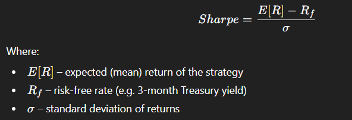
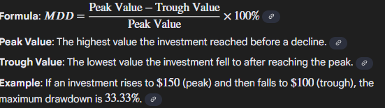

# Backtesting framework

## Data Generation

You can run `core/data_gen.py` to dowload historical data for every S&P500 company. List of symbols are taken from `data/symbols_sp500.csv` - it might be obsolete.
This script will generate one `.csv` file per symbol. 

```
Date,Adj Close,Close,High,Low,Open,Volume
2020-10-13,50.457847595214844,55.20000076293945,56.54999923706055,55.08000183105469,56.04999923706055,1406000
2020-10-14,50.79606246948242,55.56999969482422,56.06999969482422,55.16999816894531,55.56999969482422,1005000
2020-10-15,51.033729553222656,55.83000183105469,55.88999938964844,54.810001373291016,55.0,893200
2020-10-16,50.61323928833008,55.369998931884766,56.54999923706055,55.20000076293945,56.18000030517578,1155200
...
...
```

Those `.csv` files are not commited to the repo.


## 1) Long-Term Study: Russell 3000 Index vs SPY

### Goal of this Study
The goal of this exercise is to perform a **long-term comparative analysis** between two major U.S. stock market indices:
- **Russell 3000 Index** — represents almost the entire U.S. stock market (around 98% of investable equity).
- **SPY (ETF tracking the S&P 500)** — represents only the 500 largest U.S. companies.

By comparing them, we learn how the broader market (large + mid + small-cap stocks) behaves compared to the large-cap segment only.  
This is an essential skill for **Quant Developers** and **Quant Researchers**, because understanding market benchmarks and their long-term behavior provides the foundation for building and evaluating trading strategies.

---

### Why This Matters

1. **Market Context**
   - Before testing or building a trading strategy, quants analyze how the *underlying market* behaves.
   - Comparing Russell 3000 and SPY shows how different parts of the market (broad vs large-cap) move in various conditions (bull/bear markets, crises, recoveries).

2. **Benchmarking**
   - A benchmark is a reference used to evaluate performance.
   - For example, if your strategy makes +12% per year but SPY makes +14%, you are *underperforming the market*.
   - By studying both indices, we learn how to select the right benchmark for a given strategy.

3. **Long-Term Market Behavior**
   - The study focuses on several decades of data to observe trends, correlations, and risk-return patterns.
   - This helps quants develop *market intuition* — understanding what “normal” looks like for different market segments.

4. **Index Replication**
   - Quant Developers often need to simulate or backtest portfolios that replicate an index (e.g., tracking Russell 3000).
   - This exercise shows how to retrieve data, compute returns, and replicate index-level behavior programmatically.

---

### Concepts Explained

| Term | Explanation |
|------|--------------|
| **Index** | A portfolio of stocks that represents a segment of the financial market. For example, the S&P 500 includes 500 large U.S. companies. |
| **ETF (Exchange-Traded Fund)** | A tradable security that tracks the performance of an index. Example: `SPY` tracks the S&P 500, `IWV` tracks the Russell 3000. |
| **Large-cap / Mid-cap / Small-cap** | Categories of companies based on market capitalization (total stock value). Large-cap = stable giants; small-cap = smaller, more volatile firms. |
| **Benchmark** | A reference point to measure strategy performance. Usually an index or ETF representing the market. |
| **Return** | The percentage change in the value of an asset or index. Example: `(Price_today - Price_yesterday) / Price_yesterday`. |
| **Cumulative Return** | The total compounded return over time, showing how an investment grows from a starting point. |
| **Volatility** | Statistical measure of price fluctuations (risk). Higher volatility = higher uncertainty. |
| **Drawdown** | The decline from a historical peak to a subsequent trough, showing potential loss exposure. |
| **Sharpe Ratio** | Measures risk-adjusted return — how much return is generated per unit of risk (volatility). |
| **Correlation** | Measures how two assets move together. A value near 1.0 means they move almost identically. |
| **Rolling Window Analysis** | Computing statistics (like returns or correlation) over a moving time window to study how metrics evolve dynamically. |

### Annualized Return

Annualized return (also called Compound Annual Growth Rate – CAGR) measures how much the investment or strategy would have grown per year, assuming returns are reinvested.


Where:
- Rtotal: cumulative return over the whole period
- N: number of trading periods
- freq: number of trading periods per year (≈252 for daily data)

Intuition:
It converts the entire performance over multiple days into an annual equivalent.
This allows you to compare strategies of different time horizons (e.g. a 6-month backtest vs. a 3-year one).

Interpretation:
- Higher annualized return → higher long-term growth potential
- Negative value → the strategy is losing value over time

### Annualized Volatility

Definition:
Annualized volatility measures the standard deviation of daily returns, scaled to one year.
It represents how much the returns fluctuate — i.e., how risky or unstable the strategy is.



Intuition:
It quantifies uncertainty. If a strategy has 20% annualized volatility, it means its returns typically vary ±20% per year around the mean.

Interpretation:
- Low volatility = smoother, more stable returns
- High volatility = higher risk, more unpredictable outcomes

## Sharpe Ratio

Definition:
The Sharpe Ratio measures the risk-adjusted return — how much excess return a strategy earns for each unit of risk taken



Intuition:
It tells you whether a strategy’s returns come from skill or luck.
Two strategies might earn 10% per year, but if one has half the volatility — it’s twice as efficient.

## Maximum drawdown

Key metric that represents the largest peak-to-trough decline in an investment's value over a specified period, indicating downside risk and volatility.

